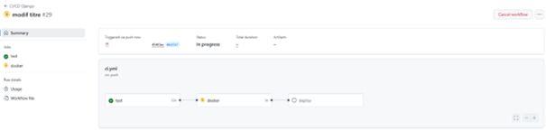
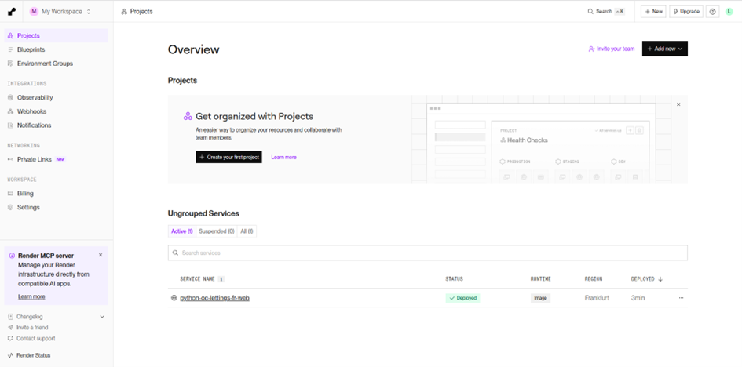
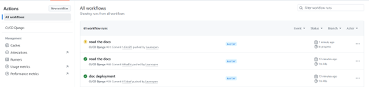

Procédures de Déploiement
=========================

Déploiement automatisé
----------------------

Le projet OC Lettings utilise un système de déploiement automatisé basé sur GitHub Actions et Render.

Pipeline CI/CD
~~~~~~~~~~~~~~

Le déploiement est déclenché automatiquement via **GitHub Actions** lors de chaque push sur la branche principale.

**Processus automatique :**

1. **Déclenchement** : Push de code sur GitHub
2. **CI/CD Pipeline** : GitHub Actions exécute les tests et validations
3. **Déploiement automatique** : L'application est déployée sur Render

Plateforme d'hébergement
~~~~~~~~~~~~~~~~~~~~~~~~

L'application est hébergée sur **Render**, qui assure :

* **Déploiement automatique** depuis GitHub
* **Scalabilité** automatique
* **HTTPS** par défaut
* **Monitoring** intégré

Configuration requise
--------------------

Variables d'environnement sur Render
~~~~~~~~~~~~~~~~~~~~~~~~~~~~~~~~~~~

Les variables suivantes doivent être configurées dans l'interface Render :

* ``SECRET_KEY`` : Clé secrète Django
* ``DEBUG`` : False pour la production

Fichiers de configuration
~~~~~~~~~~~~~~~~~~~~~~~~~

Le projet doit inclure les fichiers suivants pour le déploiement :

* ``.github/workflows/`` : Configuration GitHub Actions
* ``requirements.txt`` : Dépendances Python

Processus de mise à jour
------------------------

Pour déployer une nouvelle version :

1. **Développer** les modifications en local
2. **Tester** avec ``pytest`` et ``flake8``
3. **Commit et push** sur GitHub
4. **Déploiement automatique** via le pipeline CI/CD
5. **Vérification** sur l'URL de production Render
